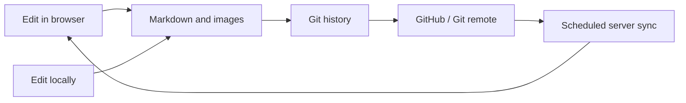

<p align="center">
  <strong>English</strong> · <a href="./README.zh-CN.md">简体中文</a>
</p>

<p align="center">
  
</p>

<h1 align="center">MyNote</h1>

<p align="center"><strong>Keep your notes as Markdown files without giving up a modern web editing experience.</strong></p>

<p align="center">
  Capture ideas in the browser, refine them in your favorite editor, and let Git record and sync every saved change.
</p>

<p align="center">
  <a href="#quick-start">Quick Start</a> ·
  <a href="#features">Features</a> ·
  <a href="#docker-deployment">Docker Deployment</a> ·
  <a href="#automatic-updates-with-systemd">Automatic Updates</a>
</p>

## Why MyNote

Many note-taking apps keep your content in a proprietary database or cloud service. MyNote takes a different approach: **your files are the source of truth, the web app is a convenient editing interface, and Git is the version history.**

> **MyNote = Markdown files + web editor + Git history + self-hosting**

| Core benefit | What it gives you |
| --- | --- |
| 📄 **You own the files** | Every note is a plain `.md` file, with no proprietary format or database lock-in |
| ✍️ **Two ways to edit** | Write in the web app or use VS Code, Obsidian, or any other text editor |
| 🕘 **Every change is traceable** | Saving and deleting create Git commits, with repository-wide and per-note history |
| 🔄 **Transparent multi-device sync** | Push locally edited files to GitHub and let the server pull them, or push directly from the web app |
| 🖼️ **More than plain text** | Tags, full-text search, image paste, drag-and-drop upload, and Markdown preview are built in |
| 🏠 **Run it where you want** | Use it locally or deploy it to your own server with Docker |

### How it differs from typical web note apps

| Typical web note app | MyNote |
| --- | --- |
| Stores content in a database | Stores content directly in `notes/` |
| Usually limits editing to its own clients | Works in the browser and in any Markdown editor |
| Requires an export before migration | Move it by copying the folder or cloning the repository |
| Controls how much history is retained | Uses Git for complete, portable history |
| May become unusable when the service shuts down | Markdown files always remain independently readable |

## Quick Start

```bash
git clone https://github.com/YOUR_USERNAME/MyNote.git
cd MyNote
npm ci
npm run dev
```

Open `http://localhost:3000` to explore the included sample notes, try search and tag filters, or create your own note. No database or schema initialization is required. The examples contain no private data and can be edited or deleted at any time.

> [!TIP]
> Replace `YOUR_USERNAME` with the actual GitHub account name. If you intend to store private notes, put MyNote in your own **private repository**. Public repositories and public forks are not suitable for private content.

## Features

| Writing experience | Note management |
| --- | --- |
| Markdown editing with live preview | Full-text search across titles and content |
| Separate reading and editing modes | YAML Frontmatter tags and tag filters |
| Toolbar for common Markdown syntax | Infinite loading in batches of 12 notes |
| Responsive desktop and mobile layouts | Delete confirmation and related-image cleanup |
| Language selector with English as the default | English and Simplified Chinese included; preference saved in the browser |
| Light, dark, and system themes | External edit conflict detection |
| File picker, screenshot paste, and drag-and-drop image upload | Standard relative Markdown image paths |

| Git and sync | Deployment and operations |
| --- | --- |
| Automatic commit and push after saving | Multi-stage Docker image |
| Repository history and commit diffs | Binds to `127.0.0.1:3100` by default |
| Detailed history for each note | Docker health check |
| File version checks to prevent accidental overwrites | systemd checks the remote every minute |
| One Git workflow for source code and notes | Note-only changes do not rebuild the container |

## Who It Is For

- People who want to own their note files instead of depending on a cloud note platform
- Developers already comfortable with Markdown, Git, VS Code, or Obsidian
- Anyone who wants the same Markdown notes available in desktop and mobile browsers
- People running personal servers, NAS devices, or home labs
- Users who need clear edit history without maintaining a database

## How It Works



Notes remain ordinary Markdown files and do not depend on a dedicated database. Docker Compose mounts the host repository at `/repository`, so notes, images, and Git history survive container rebuilds.

> [!IMPORTANT]
> The web editor does not continuously write while you type. MyNote writes the file, creates a Git commit, and attempts to push only after you click **Save and sync**, making the exact save point explicit.

> [!WARNING]
> MyNote does not include a built-in account system. Never expose an unprotected application port directly to the internet. Production deployments must use Cloudflare Access, an authenticated reverse proxy, or another reliable access-control layer. Notes, images, and Git history in a public repository are visible to everyone. Never commit passwords, private keys, access tokens, or other secrets.

## Technology Stack

- [Nuxt](https://nuxt.com/) 4
- [Vue](https://vuejs.org/) 3
- [Nitro](https://nitro.build/)
- TypeScript
- [Marked](https://marked.js.org/) and DOMPurify
- Git, Docker Compose, and systemd

## Project Structure

```text
MyNote/
├── app/                    # Vue pages, components, and styles
├── server/                 # Nitro API, file operations, and Git sync
├── shared/                 # Types and utilities shared by client and server
├── notes/                  # Markdown notes and image assets
├── public/                 # Logo and site icons
├── docker/                 # Container entrypoint scripts
├── deploy/                 # systemd automatic sync scripts
├── compose.yml             # Base Docker Compose configuration
├── compose.github.yml      # GitHub SSH secret extension
└── Dockerfile
```

## Note Format

The first level-one heading is used as the title by default. Tags are stored in YAML Frontmatter:

```md
---
tags: [Nuxt, Docker]
---

# Deployment Notes

Write your note here.
```

Images uploaded through the web app are stored in a dedicated directory named after the note:

```text
notes/
├── Deployment Notes.md
└── Deployment Notes.assets/
    └── 20260921131859-ab12cd34.webp
```

Images use relative Markdown paths, so they also render in VS Code, Obsidian, and other external editors:

```md

```

## Local Development

### Requirements

- Node.js 22 or later
- npm
- Git

### Start the Project

```bash
git clone https://github.com/YOUR_USERNAME/MyNote.git
cd MyNote
npm ci
cp .env.example .env
npm run dev
```

Open `http://localhost:3000` in your browser.

MyNote reads the repository's `notes` directory by default. To use a different directory, edit `.env`:

```dotenv
NUXT_NOTES_DIRECTORY=./notes
```

Common commands:

```bash
npm run dev        # Start the development server
npm run typecheck  # Run TypeScript checks
npm run build      # Create a production build
npm run preview    # Preview the production build
```

### Add Another Interface Language

Language metadata and translations are registered in `app/composables/useI18n.ts`. To add a language:

1. Add its code, native label, and short label to `appLocaleOptions`.
2. Add a complete translation table for the new locale.
3. Register that table in `messages`.

The language menu reads the registry automatically. TypeScript requires every registered translation table to contain the same keys as English, so missing interface text is detected during `npm run typecheck`.

## Saving and Git Sync

After you click **Save and sync**, the server performs these steps:

1. Compares note versions to detect changes made by another editor.
2. Writes the Markdown file atomically and saves newly uploaded images.
3. Stages the note and its dedicated asset directory in Git.
4. Creates a Git commit.
5. Runs `git push` if the repository has a remote.

Deleting a note also deletes its matching `.assets` directory and records both operations in the same commit. If the file is written successfully but the Git commit or push fails, MyNote keeps the local change and displays the error in the interface.

## Docker Deployment

This setup is suitable for local server access or for use behind a secure access layer that you configure separately.

### 1. Prepare the Server

The server needs:

- Linux
- Git
- Docker Engine
- Docker Compose Plugin (`docker compose version` must work)

### 2. Clone and Configure

```bash
sudo mkdir -p /opt/MyNote
sudo chown "$USER":"$USER" /opt/MyNote
git clone https://github.com/YOUR_USERNAME/MyNote.git /opt/MyNote
cd /opt/MyNote
cp .env.docker.example .env
```

Edit `.env`:

```dotenv
MYNOTE_BIND_ADDRESS=127.0.0.1
MYNOTE_PORT=3100
MYNOTE_APP_NAME=MyNote
MYNOTE_MODE=notes
MYNOTE_BLOG_DESCRIPTION=A Git-powered Markdown blog.
MYNOTE_READ_ONLY=false
GIT_USER_NAME=MyNote
GIT_USER_EMAIL=mynote@example.com
GITHUB_DEPLOY_KEY_PATH=/opt/MyNote/docker-secrets/github_deploy_key
```

### 3. Build and Start

```bash
docker compose up -d --build
```

### 4. Check the Deployment

```bash
docker compose ps
docker compose logs --tail=100 mynote
curl http://127.0.0.1:3100/api/notes
```

By default, MyNote listens only on `127.0.0.1:3100` and does not accept direct public connections. Do not change `MYNOTE_BIND_ADDRESS` to `0.0.0.0` merely for convenience unless a properly configured firewall and authentication layer already protect the server.

Stop or restart the application:

```bash
docker compose stop
docker compose restart
```

## Configure Automatic Pushes to GitHub

To push web edits automatically, create a dedicated Deploy Key with write permission for this repository. Do not use a personal SSH key that grants access to your entire GitHub account.

### 1. Create a Repository-Specific Key

```bash
cd /opt/MyNote
mkdir -p docker-secrets
ssh-keygen -t ed25519 -C "mynote-deploy" -f docker-secrets/github_deploy_key
chmod 600 docker-secrets/github_deploy_key
```

This creates:

```text
docker-secrets/github_deploy_key      # Private key — never copy or commit it
docker-secrets/github_deploy_key.pub  # Public key — add this to GitHub
```

`docker-secrets/` is excluded by both `.gitignore` and `.dockerignore`.

### 2. Add the GitHub Deploy Key

Open the GitHub repository and go to:

```text
Settings → Deploy keys → Add deploy key
```

Enter a name, paste the output of the following command, and enable **Allow write access**:

```bash
cat /opt/MyNote/docker-secrets/github_deploy_key.pub
```

### 3. Switch the Remote to SSH

```bash
cd /opt/MyNote
git remote set-url origin git@github.com:YOUR_USERNAME/MyNote.git
ssh -i /opt/MyNote/docker-secrets/github_deploy_key -o IdentitiesOnly=yes -T git@github.com
```

A “successfully authenticated” message confirms that the key works. GitHub does not provide shell access, so the following “no shell access” message is expected.

### 4. Configure the Key Path

Make sure `.env` uses an absolute path rather than `~`:

```dotenv
GITHUB_DEPLOY_KEY_PATH=/opt/MyNote/docker-secrets/github_deploy_key
```

### 5. Start with the GitHub Compose Extension

```bash
docker compose -f compose.yml -f compose.github.yml up -d --build
```

`compose.github.yml` mounts the private key as a read-only Docker Secret and configures Git commands to use that key.

## Automatic Updates with systemd

The included installer creates a timer that checks `origin/main` every minute:

- When only `notes/` changes, the repository fast-forwards and the changes become available without rebuilding the container.
- When application source or deployment configuration changes, the container is rebuilt and restarted automatically.
- When the working tree contains uncommitted changes or the branches have diverged, synchronization stops instead of overwriting data.
- When a build fails, the deployed revision marker is not updated, so the next timer run retries the build.

### Prerequisites

1. The project has been cloned to the server.
2. `origin` points to the GitHub repository that should be synchronized.
3. The Deploy Key has been added to GitHub with write access.
4. The private key is stored at `docker-secrets/github_deploy_key`, or another absolute path is configured in `.env`.
5. `docker`, `git`, `flock`, and `systemctl` are installed.

### One-Command Installation

```bash
cd /opt/MyNote
sudo ./deploy/install-systemd-sync.sh
```

The installer:

1. Creates `.env` if it does not exist.
2. Verifies the Deploy Key path and Docker Compose configuration.
3. Builds and starts MyNote for the first time.
4. Installs `mynote-sync.service` and `mynote-sync.timer`.
5. Checks GitHub for updates every 60 seconds.

### Manage Automatic Sync

```bash
# Inspect the timer
systemctl status mynote-sync.timer
systemctl list-timers mynote-sync.timer

# Run synchronization immediately
systemctl start mynote-sync.service

# Show recent logs
journalctl -u mynote-sync.service -n 100 --no-pager

# Follow logs
journalctl -u mynote-sync.service -f

# Pause and resume
systemctl stop mynote-sync.timer
systemctl start mynote-sync.timer
```

## Sync from a Local Editor to the Server

After changing the source code or `notes` locally:

```bash
git add -A
git commit -m "Update notes"
git push origin main
```

The server's systemd timer pulls the update on its next run. Note and image changes appear directly in the mounted directory, while source-code changes trigger a Docker rebuild.

Saving from the web app also creates and pushes commits. If a local editor and the web app produce commits concurrently, the later push may fail because the remote already has a new commit. Avoid editing from both places at the same time. If a conflict occurs, inspect the repository changes first, then run:

```bash
git pull --rebase origin main
git push origin main
```

Do not run Git commands that discard changes until you have inspected the working tree.

## Secure Access

### SSH Tunnel

If you do not want to configure a public domain, create an SSH tunnel from your local machine:

```bash
ssh -L 3100:127.0.0.1:3100 USER@SERVER_IP
```

Then open `http://127.0.0.1:3100`.

### Cloudflare Tunnel and Access

Recommended setup:

1. Create a Self-hosted Application in Cloudflare Zero Trust.
2. Add an Allow Policy restricted to your own email address or identity group.
3. Enable MFA and avoid `Everyone` or `Bypass` rules.
4. Create a Cloudflare Tunnel and install `cloudflared` on the server.
5. Point the Public Hostname service to `http://127.0.0.1:3100`.
6. Confirm that both the home page and `/api/*` are protected by the same Access Application.
7. Keep port 3100 bound to `127.0.0.1`; do not create another public route that bypasses Access.

MyNote does not authenticate users itself. Cloudflare Access or another upstream authentication system is the security boundary for production deployments.

## Blog Mode

Blog mode turns the same Markdown repository into a public, read-only blog. Configure `.env`:

```dotenv
MYNOTE_MODE=blog
MYNOTE_APP_NAME=MyNote Blog
MYNOTE_BLOG_DESCRIPTION=Writing about software, tools, and ideas.
MYNOTE_SITE_URL=https://blog.example.com
```

Blog mode automatically enables all read-only protections, uses the protected `compose.demo.yml` deployment, hides editor and Git-history interfaces, and rejects mutation APIs. Articles continue to live in `notes/`:

```md
---
title: Building a Git-powered Blog
description: Publishing Markdown articles from Git without a database.
date: 2026-09-21
updated: 2026-09-22
tags: [Nuxt, Git, Markdown]
cover: ./Building a Git-powered Blog.assets/cover.webp
draft: false
---

# Building a Git-powered Blog

Article content goes here.
```

Supported publication fields:

| Field | Purpose |
| --- | --- |
| `title` | Article title; falls back to the first level-one heading |
| `description` | Article-list summary and page description |
| `date` | Publication date and article sort order |
| `updated` | Optional last-updated date |
| `tags` | Article tags used for filtering |
| `cover` | Optional absolute or note-relative cover image |
| `draft` | Hides the article when `true` |

Future-dated articles and drafts are excluded from lists, search, and direct article requests. In a public repository, `draft: true` does not make the source private; it only hides the article from the blog interface.

Publish from a local editor:

```bash
git add notes
git commit -m "Publish a new article"
git push origin main
```

The systemd timer pulls the commit within about a minute. Note-only changes appear without rebuilding the container.

Public blog features include:

- server-rendered article and archive pages;
- canonical URLs, Open Graph metadata, and Schema.org structured data;
- an archive at `/archive`;
- an RSS feed at `/rss.xml`;
- a sitemap at `/sitemap.xml`;
- a mode-aware `/robots.txt` that blocks indexing in notes mode;
- server-side Markdown sanitization with DOMPurify.

Set `MYNOTE_SITE_URL` to the final public HTTPS origin without a trailing slash. It is used to generate canonical, Open Graph, RSS, Sitemap, and robots URLs.

## Read-only Demo Mode

Use read-only mode for a public demonstration site. Set the following value in `.env`:

```dotenv
MYNOTE_READ_ONLY=true
```

Then run the systemd installer normally:

```bash
cd /opt/MyNote
sudo ./deploy/install-systemd-sync.sh
```

The installer automatically uses `compose.demo.yml`. In this mode:

- the interface identifies the site as a read-only demo;
- new, edit, delete, and upload controls are unavailable;
- write and upload API requests return HTTP `403`;
- the repository is mounted read-only inside the container;
- the GitHub private key is not mounted into the container;
- the host systemd timer can still pull repository updates.

To start the demo without installing the timer:

```bash
docker compose -f compose.yml -f compose.demo.yml up -d --build
```

## Environment Variables

| Variable | Default | Description |
| --- | --- | --- |
| `NUXT_NOTES_DIRECTORY` | `./notes` | Notes directory outside Docker |
| `MYNOTE_BIND_ADDRESS` | `127.0.0.1` | Host address used by Docker |
| `MYNOTE_PORT` | `3100` | Host port used by Docker |
| `MYNOTE_APP_NAME` | `MyNote` | Application name displayed in the UI |
| `MYNOTE_MODE` | `notes` | Interface mode: `notes` or `blog`; blog mode is always read-only |
| `MYNOTE_BLOG_DESCRIPTION` | `A Git-powered Markdown blog.` | Introduction displayed on the blog home page |
| `MYNOTE_SITE_URL` | Empty | Public HTTPS origin used for canonical URLs, RSS, and Sitemap |
| `MYNOTE_READ_ONLY` | `false` | Enables protected read-only demo mode when set to `true` |
| `GIT_USER_NAME` | `MyNote` | Git author name for automatic commits |
| `GIT_USER_EMAIL` | `mynote@localhost` | Git author email for automatic commits |
| `GITHUB_DEPLOY_KEY_PATH` | `./docker-secrets/github_deploy_key` | Path to the GitHub Deploy Key private key |
| `MYNOTE_REPOSITORY` | Set by the installer | Repository path used by systemd sync |

The container always uses:

```text
NUXT_NOTES_DIRECTORY=/repository/notes
MYNOTE_REPOSITORY_DIRECTORY=/repository
NITRO_PORT=3000
NUXT_PUBLIC_APP_MODE=notes
NUXT_PUBLIC_SITE_URL=
```

These container-internal variables normally do not need to be changed.

## Backup and Recovery

The GitHub remote is the primary off-site backup, but commits that have not been pushed successfully exist only on the server. Check the repository regularly:

```bash
cd /opt/MyNote
git status
git log --oneline -5
git fetch origin
git status -sb
```

To restore MyNote on a new server, clone the repository, configure the Deploy Key and `.env`, and run the installation script again.

After a note is deleted, its old content may remain in Git history. If a password, token, or private key is committed accidentally, revoke and rotate the credential first, then rewrite the repository history by following GitHub's sensitive-data removal guidance.

## Troubleshooting

### Port 3100 Is Already in Use

Edit `.env`:

```dotenv
MYNOTE_PORT=3200
```

Then restart:

```bash
docker compose -f compose.yml -f compose.github.yml up -d
```

### The Container Cannot Read the SSH Key

Check the path and permissions:

```bash
grep '^GITHUB_DEPLOY_KEY_PATH=' .env
ls -l /opt/MyNote/docker-secrets/github_deploy_key
chmod 600 /opt/MyNote/docker-secrets/github_deploy_key
```

The path must be absolute on the host, and the file must exist.

### The Web Save Succeeds but Git Push Fails

```bash
cd /opt/MyNote
git status -sb
git log --oneline --decorate -5
git remote -v
```

If the remote has new commits, first confirm that there are no uncommitted changes, then use `git pull --rebase origin main`. If SSH authentication fails, recheck the Deploy Key and remote URL.

### systemd Does Not Update Automatically

```bash
systemctl status mynote-sync.timer
systemctl status mynote-sync.service
journalctl -u mynote-sync.service -n 100 --no-pager
```

The sync script intentionally refuses to overwrite a dirty working tree or a diverged branch. The log explains why synchronization stopped.

### Inspect Container Health

```bash
docker inspect --format '{{json .State.Health}}' mynote
docker compose logs --tail=100 mynote
curl http://127.0.0.1:3100/api/notes
```

## Contributing

Issues and pull requests are welcome. Before submitting a change, run at least:

```bash
npm ci
npm run typecheck
npm run build
```

Do not include real notes, server addresses, keys, or personal data in examples, test files, or commit history.

## License

MyNote is released under the [MIT License](./LICENSE).
