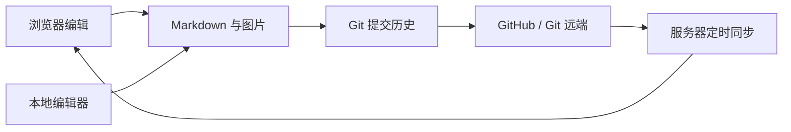

<p align="center">
  <a href="./README.md">English</a> · <strong>简体中文</strong>
</p>

<p align="center">
  
</p>

<h1 align="center">MyNote</h1>

<p align="center"><strong>把笔记留在自己的 Markdown 文件里，同时拥有现代网页编辑体验。</strong></p>

<p align="center">
  浏览器里随手写，本地编辑器里深度改；点击保存，Git 自动记录并同步每一次变化。
</p>

<p align="center">
  <a href="#快速体验">快速体验</a> ·
  <a href="#功能一览">功能一览</a> ·
  <a href="#docker-快速部署">Docker 部署</a> ·
  <a href="#systemd-自动拉取与部署">自动更新</a>
</p>

## 为什么选择 MyNote

许多笔记应用把内容保存在专用数据库或云服务中。MyNote 选择另一条路径：**文件才是数据本体，网页只是更舒服的编辑入口，Git 才是版本历史。**

> **MyNote = Markdown 文件 + 网页编辑器 + Git 历史 + 自托管部署**

| 核心优势 | 你能得到什么 |
| --- | --- |
| 📄 **文件属于你** | 每篇笔记都是普通 `.md` 文件，不被数据库或私有格式锁定 |
| ✍️ **两种编辑方式** | 可在网页中编辑，也可直接使用 VS Code、Obsidian 或其他文本编辑器 |
| 🕘 **每次修改可追溯** | 保存、删除都会形成 Git 提交，可查看整库历史和单篇笔记历史 |
| 🔄 **多端同步简单透明** | 本地提交到 GitHub，服务器自动拉取；网页保存也能直接推送 |
| 🖼️ **不只支持纯文字** | 标签、全文搜索、图片粘贴、拖拽上传和 Markdown 预览全部内置 |
| 🏠 **运行位置由你决定** | 可以只在本机运行，也可以使用 Docker 部署到自己的服务器 |

### 和常见笔记方案有什么不同

| 常见网页笔记应用 | MyNote |
| --- | --- |
| 内容保存在数据库中 | 内容直接保存在 `notes/` 目录 |
| 通常只能在指定客户端编辑 | 浏览器和任意 Markdown 编辑器都能编辑 |
| 数据导出后才能迁移 | 复制文件夹或克隆仓库即可迁移 |
| 历史版本由平台决定 | Git 完整记录历史，可自行备份和恢复 |
| 服务停止后可能难以继续使用 | Markdown 文件始终可以独立读取 |

## 快速体验

```bash
git clone https://github.com/YOUR_USERNAME/MyNote.git
cd MyNote
npm ci
npm run dev
```

打开 `http://localhost:3000`，即可浏览内置示例笔记、体验搜索和标签筛选，或者新建自己的笔记。无需数据库，也无需初始化数据表。示例不包含私人数据，可以随时编辑或删除。

> [!TIP]
> `YOUR_USERNAME` 需要替换为实际的 GitHub 用户名。准备保存私人笔记时，建议把项目放入你自己的 **Private 仓库**；公共仓库及公共 Fork 不适合存放私人内容。

## 功能一览

| 写作体验 | 笔记管理 |
| --- | --- |
| Markdown 编辑与实时预览 | 标题和正文全文搜索 |
| 阅读、编辑模式分离 | YAML Frontmatter 标签与筛选 |
| 常用 Markdown 格式工具栏 | 12 条一批的触底加载 |
| 自动适配桌面端和移动端 | 删除确认与关联图片清理 |
| 默认英文的语言选择菜单 | 内置英文和简体中文，语言偏好保存在浏览器中 |
| 浅色、深色和跟随系统主题 | 外部编辑冲突检测 |
| 图片选择、截图粘贴和拖拽上传 | 图片使用标准 Markdown 相对路径 |

| Git 与同步 | 部署与运维 |
| --- | --- |
| 保存后自动提交并推送 | 多阶段 Docker 镜像 |
| 全部更新历史与提交 Diff | 默认仅监听 `127.0.0.1:3100` |
| 单篇笔记详细历史 | Docker 健康检查 |
| 文件版本校验，避免误覆盖 | systemd 每分钟检查远端更新 |
| 源码和笔记使用同一套 Git 流程 | 仅笔记变化时无需重建容器 |

## 适合谁

- 希望自己掌握笔记文件，而不是依赖某个云笔记平台的人
- 已经习惯 Markdown、Git、VS Code 或 Obsidian 的开发者
- 想在手机和电脑浏览器中访问同一套 Markdown 笔记的人
- 希望把笔记部署在个人服务器、NAS 或家庭实验室的人
- 需要清晰修改历史，但不想维护数据库的人

## 工作方式



笔记始终是普通 Markdown 文件，不依赖专用数据库。Compose 会把宿主机仓库挂载到容器的 `/repository`，因此笔记、图片和 Git 历史不会因容器重建而丢失。

> [!IMPORTANT]
> 网页编辑不会边输入边写盘。只有点击“保存并同步”后，MyNote 才会写入文件、创建 Git 提交并尝试推送远端，修改时机清晰可控。

> [!WARNING]
> MyNote 没有内置账户系统。不要把未受保护的服务端口直接暴露到公网。生产环境必须配置 Cloudflare Access、带认证的反向代理或其他可靠的访问控制。公开仓库中的笔记、图片及其 Git 历史对所有人可见，不要提交密码、私钥、访问令牌等秘密。

## 技术栈

- [Nuxt](https://nuxt.com/) 4
- [Vue](https://vuejs.org/) 3
- [Nitro](https://nitro.build/)
- TypeScript
- [Marked](https://marked.js.org/) 和 DOMPurify
- Git、Docker Compose、systemd

## 项目结构

```text
MyNote/
├── app/                    # Vue 页面、组件和样式
├── server/                 # Nitro API、文件操作和 Git 同步
├── shared/                 # 前后端共享类型与工具
├── notes/                  # Markdown 笔记与图片资源
├── public/                 # Logo 和站点图标
├── docker/                 # 容器入口脚本
├── deploy/                 # systemd 自动同步脚本
├── compose.yml             # 基础 Docker Compose 配置
├── compose.github.yml      # GitHub SSH Secret 扩展配置
└── Dockerfile
```

## 笔记格式

标题默认读取第一个一级标题，标签保存在 YAML Frontmatter 中：

```md
---
tags: [Nuxt, Docker]
---

# 部署记录

这里是正文。
```

网页上传的图片保存在与笔记同名的专属目录中：

```text
notes/
├── 部署记录.md
└── 部署记录.assets/
    └── 20260921131859-ab12cd34.webp
```

Markdown 使用相对路径引用图片，所以在 VS Code、Obsidian 等外部编辑器中也可以正常显示：

```md

```

## 本地开发

### 环境要求

- Node.js 22 或更高版本
- npm
- Git

### 启动项目

```bash
git clone https://github.com/YOUR_USERNAME/MyNote.git
cd MyNote
npm ci
cp .env.example .env
npm run dev
```

浏览器访问 `http://localhost:3000`。

默认读取项目中的 `notes` 目录。如需使用其他目录，修改 `.env`：

```dotenv
NUXT_NOTES_DIRECTORY=./notes
```

常用命令：

```bash
npm run dev        # 启动开发服务器
npm run typecheck  # TypeScript 检查
npm run build      # 生产构建
npm run preview    # 预览生产构建
```

### 增加新的界面语言

语言信息和翻译统一注册在 `app/composables/useI18n.ts` 中。增加语言时：

1. 在 `appLocaleOptions` 中加入语言代码、语言原生名称和短标签；
2. 为新语言增加完整翻译表；
3. 将翻译表注册到 `messages`。

语言选择菜单会自动读取注册表。TypeScript 会要求每份翻译表包含与英文相同的键，因此执行 `npm run typecheck` 时即可发现遗漏的界面文案。

## 保存与 Git 同步

点击“保存并同步”后，服务端会依次执行：

1. 比较笔记版本，检查文件是否被其他程序修改；
2. 原子写入 Markdown 文件，并保存本次新增的图片；
3. 将当前笔记及其专属图片目录加入 Git 暂存区；
4. 创建 Git 提交；
5. 如果仓库存在远端，则运行 `git push`。

删除笔记时，其同名 `.assets` 目录会一起删除并写入同一次 Git 提交。文件写入成功但 Git 提交或推送失败时，应用会保留本地修改并在界面中显示错误原因。

## Docker 快速部署

适合只在服务器本机使用，或者自行配置安全入口的场景。

### 1. 准备环境

服务器需要：

- Linux
- Git
- Docker Engine
- Docker Compose Plugin（可以运行 `docker compose version`）

### 2. 克隆并配置

```bash
sudo mkdir -p /opt/MyNote
sudo chown "$USER":"$USER" /opt/MyNote
git clone https://github.com/YOUR_USERNAME/MyNote.git /opt/MyNote
cd /opt/MyNote
cp .env.docker.example .env
```

编辑 `.env`：

```dotenv
MYNOTE_BIND_ADDRESS=127.0.0.1
MYNOTE_PORT=3100
MYNOTE_APP_NAME=MyNote
MYNOTE_READ_ONLY=false
GIT_USER_NAME=MyNote
GIT_USER_EMAIL=mynote@example.com
GITHUB_DEPLOY_KEY_PATH=/opt/MyNote/docker-secrets/github_deploy_key
```

### 3. 构建并启动

```bash
docker compose up -d --build
```

### 4. 检查运行状态

```bash
docker compose ps
docker compose logs --tail=100 mynote
curl http://127.0.0.1:3100/api/notes
```

默认只监听 `127.0.0.1:3100`，不会直接接受公网连接。不要为了方便把 `MYNOTE_BIND_ADDRESS` 改为 `0.0.0.0`，除非服务器前方已经有完善的防火墙和身份认证。

停止或重启：

```bash
docker compose stop
docker compose restart
```

## 配置 GitHub 自动推送

如果需要在网页保存后自动推送到 GitHub，推荐为这个仓库创建一把独立的、具有写权限的 Deploy Key。不要使用能够访问整个 GitHub 账户的个人 SSH Key。

### 1. 创建仓库专用密钥

```bash
cd /opt/MyNote
mkdir -p docker-secrets
ssh-keygen -t ed25519 -C "mynote-deploy" -f docker-secrets/github_deploy_key
chmod 600 docker-secrets/github_deploy_key
```

该命令会生成：

```text
docker-secrets/github_deploy_key      # 私钥，不要复制或提交
docker-secrets/github_deploy_key.pub  # 公钥，添加到 GitHub
```

`docker-secrets/` 已被 `.gitignore` 和 `.dockerignore` 排除。

### 2. 添加 GitHub Deploy Key

打开 GitHub 仓库：

```text
Settings → Deploy keys → Add deploy key
```

填写名称，粘贴以下命令输出的公钥，并勾选 **Allow write access**：

```bash
cat /opt/MyNote/docker-secrets/github_deploy_key.pub
```

### 3. 改用 SSH 远端

```bash
cd /opt/MyNote
git remote set-url origin git@github.com:YOUR_USERNAME/MyNote.git
ssh -i /opt/MyNote/docker-secrets/github_deploy_key -o IdentitiesOnly=yes -T git@github.com
```

看到“successfully authenticated”表示密钥可用。GitHub 不提供 Shell 登录，因此后半句提示没有 Shell access 是正常现象。

### 4. 配置密钥路径

确认 `.env` 中使用绝对路径，不能使用 `~`：

```dotenv
GITHUB_DEPLOY_KEY_PATH=/opt/MyNote/docker-secrets/github_deploy_key
```

### 5. 使用 GitHub Compose 扩展启动

```bash
docker compose -f compose.yml -f compose.github.yml up -d --build
```

`compose.github.yml` 会通过 Docker Secret 以只读方式把私钥挂载到容器中，并为 Git 命令配置该密钥。

## systemd 自动拉取与部署

项目提供了安装脚本，可每分钟检查一次 `origin/main`：

- 只有 `notes/` 变化：仓库快进后直接生效，不重建容器；
- 应用源码或部署配置变化：自动重新构建并启动容器；
- 工作区存在未提交修改或分支发生分叉：停止同步，避免覆盖数据；
- 构建失败：不会更新已部署版本标记，下次运行会继续重试。

### 安装前提

1. 项目已经克隆到服务器；
2. `origin` 指向需要同步的 GitHub 仓库；
3. Deploy Key 已添加到 GitHub 并允许写入；
4. 私钥位于 `docker-secrets/github_deploy_key`，或者 `.env` 已配置其他绝对路径；
5. 已安装 `docker`、`git`、`flock` 和 `systemctl`。

### 一键安装

```bash
cd /opt/MyNote
sudo ./deploy/install-systemd-sync.sh
```

安装器会：

1. 在缺失时创建 `.env`；
2. 验证 Deploy Key 路径和 Docker Compose 配置；
3. 首次构建并启动 MyNote；
4. 安装 `mynote-sync.service` 和 `mynote-sync.timer`；
5. 每 60 秒检查一次 GitHub 更新。

### 管理定时同步

```bash
# 查看定时器
systemctl status mynote-sync.timer
systemctl list-timers mynote-sync.timer

# 立即执行一次同步
systemctl start mynote-sync.service

# 查看最近日志
journalctl -u mynote-sync.service -n 100 --no-pager

# 持续查看日志
journalctl -u mynote-sync.service -f

# 暂停和恢复
systemctl stop mynote-sync.timer
systemctl start mynote-sync.timer
```

## 从本地编辑器同步到服务器

本地修改源码或 `notes` 后：

```bash
git add -A
git commit -m "Update notes"
git push origin main
```

服务器上的 systemd timer 会在下一次检查时拉取更新。笔记与图片变更会直接出现在挂载目录中；源码变更会触发 Docker 重建。

网页端保存也会创建并推送提交。如果本地和网页端同时产生提交，后推送的一方可能因为远端已有新提交而失败。建议避免同时编辑；发生冲突时，在对应仓库中先检查修改，再执行：

```bash
git pull --rebase origin main
git push origin main
```

不要在未确认工作区内容前运行会丢弃修改的 Git 命令。

## 安全访问方式

### SSH 隧道

不配置公网域名时，可以从本机建立 SSH 隧道：

```bash
ssh -L 3100:127.0.0.1:3100 USER@SERVER_IP
```

随后访问 `http://127.0.0.1:3100`。

### Cloudflare Tunnel 与 Access

推荐流程：

1. 在 Cloudflare Zero Trust 中创建 Self-hosted Application；
2. 为应用域名设置只允许本人邮箱或身份组访问的 Allow Policy；
3. 启用 MFA，并避免 `Everyone` 或 `Bypass` 规则；
4. 创建 Cloudflare Tunnel 并在服务器安装 `cloudflared`；
5. 将 Public Hostname 的 Service 指向 `http://127.0.0.1:3100`；
6. 确认首页和 `/api/*` 都受到同一个 Access Application 保护；
7. 保持 3100 端口只绑定 `127.0.0.1`，不要再建立绕过 Access 的公网入口。

MyNote 自身不会验证用户身份，Cloudflare Access 或其他上游认证是生产部署的安全边界。

## 只读演示模式

公开演示站应启用只读模式。在 `.env` 中设置：

```dotenv
MYNOTE_READ_ONLY=true
```

然后正常运行 systemd 安装器：

```bash
cd /opt/MyNote
sudo ./deploy/install-systemd-sync.sh
```

安装器会自动使用 `compose.demo.yml`。在此模式下：

- 界面会标明当前是只读演示站；
- 不显示新建、编辑、删除和上传入口；
- 写入及上传 API 会返回 HTTP `403`；
- 项目仓库以只读方式挂载到容器；
- GitHub 私钥不会挂载到容器；
- 宿主机上的 systemd 定时器仍然可以拉取仓库更新。

如果不需要安装定时同步，也可以直接启动：

```bash
docker compose -f compose.yml -f compose.demo.yml up -d --build
```

## 环境变量

| 变量 | 默认值 | 说明 |
| --- | --- | --- |
| `NUXT_NOTES_DIRECTORY` | `./notes` | 非 Docker 环境中的笔记目录 |
| `MYNOTE_BIND_ADDRESS` | `127.0.0.1` | Docker 在宿主机监听的地址 |
| `MYNOTE_PORT` | `3100` | Docker 在宿主机监听的端口 |
| `MYNOTE_APP_NAME` | `MyNote` | 页面中显示的应用名称 |
| `MYNOTE_READ_ONLY` | `false` | 设置为 `true` 时启用受保护的只读演示模式 |
| `GIT_USER_NAME` | `MyNote` | 自动提交使用的 Git 用户名 |
| `GIT_USER_EMAIL` | `mynote@localhost` | 自动提交使用的 Git 邮箱 |
| `GITHUB_DEPLOY_KEY_PATH` | `./docker-secrets/github_deploy_key` | GitHub Deploy Key 私钥路径 |
| `MYNOTE_REPOSITORY` | 安装时写入 | systemd 同步使用的仓库路径 |

容器内部固定使用：

```text
NUXT_NOTES_DIRECTORY=/repository/notes
MYNOTE_REPOSITORY_DIRECTORY=/repository
NITRO_PORT=3000
```

通常不需要修改这些容器内部变量。

## 备份与恢复

GitHub 远端是主要的异地备份，但尚未成功推送的提交只存在于服务器本地。建议定期检查：

```bash
cd /opt/MyNote
git status
git log --oneline -5
git fetch origin
git status -sb
```

恢复到新服务器时，只需重新克隆仓库、配置 Deploy Key 和 `.env`，然后重新运行安装脚本。

删除笔记后，旧内容仍可能存在于 Git 历史。若笔记中误提交了密码、Token 或私钥，应先撤销并轮换凭据，再按 GitHub 的敏感数据清理流程重写历史。

## 常见问题

### 3100 端口已被占用

修改 `.env`：

```dotenv
MYNOTE_PORT=3200
```

然后重新启动：

```bash
docker compose -f compose.yml -f compose.github.yml up -d
```

### 容器无法读取 SSH Key

检查路径和权限：

```bash
grep '^GITHUB_DEPLOY_KEY_PATH=' .env
ls -l /opt/MyNote/docker-secrets/github_deploy_key
chmod 600 /opt/MyNote/docker-secrets/github_deploy_key
```

路径必须是宿主机上的绝对路径，并且文件必须存在。

### 网页保存成功但 Git 推送失败

```bash
cd /opt/MyNote
git status -sb
git log --oneline --decorate -5
git remote -v
```

如果远端存在新的提交，先确认没有未提交修改，再使用 `git pull --rebase origin main`。如果 SSH 验证失败，重新检查 Deploy Key 和远端地址。

### systemd 没有自动更新

```bash
systemctl status mynote-sync.timer
systemctl status mynote-sync.service
journalctl -u mynote-sync.service -n 100 --no-pager
```

同步脚本会主动拒绝覆盖脏工作区或分叉分支，日志中会说明停止原因。

### 查看容器健康状态

```bash
docker inspect --format '{{json .State.Health}}' mynote
docker compose logs --tail=100 mynote
curl http://127.0.0.1:3100/api/notes
```

## 参与贡献

欢迎提交 Issue 和 Pull Request。提交前请至少运行：

```bash
npm ci
npm run typecheck
npm run build
```

请不要在示例、测试文件或提交历史中包含真实笔记、服务器地址、密钥或个人数据。

## License

[MIT](./LICENSE)
